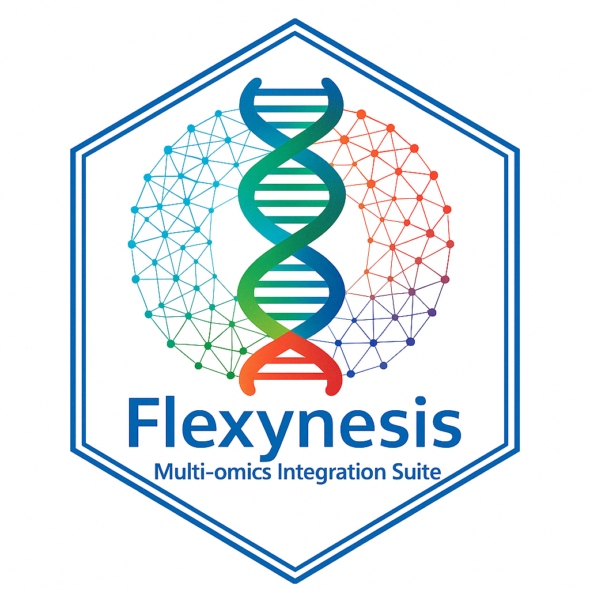

<p align="center">
  
</p>

[](https://github.com/BIMSBbioinfo/flexynesis/actions/workflows/tests.yml)


# flexynesis
A deep-learning based multi-omics bulk sequencing data integration suite with a focus on (pre-)clinical 
endpoint prediction. The package includes multiple types of deep learning architectures such as simple 
fully connected networks, supervised variational autoencoders; different options of data layer fusion, 
and automates feature selection and hyperparameter optimisation. The tools are continuosly benchmarked 
on publicly available datasets mostly related to the study of cancer. Some of the applications of the methods 
we develop are drug response modeling in cancer patients or preclinical models (such as cell lines and 
patient-derived xenografts), cancer subtype prediction, or any other clinically relevant outcome prediction
that can be formulated as a regression or classification problem. 

<p align="center">
  
</p>

# Benchmarks

For the latest benchmark results see: 
https://bimsbstatic.mdc-berlin.de/akalin/buyar/flexynesis-benchmark-datasets/dashboard.html

The code for the benchmarking pipeline is at: https://github.com/BIMSBbioinfo/flexynesis-benchmarks

# Environment

To create a clone of the development environment, use the `spec-file.txt`:
```
conda create --name flexynesis --file spec-file.txt
conda activate flexynesis
```

To export existing spec-file.txt:
```
conda list --explicit > spec-file.txt
```

# Guix

You can also create a reproducible development environment with [GNU Guix](https://guix.gnu.org).  You will need [this Guix commit](https://git.savannah.gnu.org/cgit/guix.git/commit/?id=e3e011a08141058598cc7631aeb52d620a3ccb8c) or later.

```
guix shell
```

or

```
guix shell -m manifest.scm
```

You can build a Guix package from the current committed state of your git checkout like this:

```
guix pack -f guix.scm
```

Do this to build a Docker image containing this package together with a matching Python installation:

```
guix pack -C none \
  -e '(load "guix.scm")' \
  -f docker \
  -S /bin=bin -S /lib=lib -S /share=share \
  glibc-locales coreutils bash python
```

# Installation

To install the project using setuptools, you can follow these steps:

1. Clone the project from the Git repository:
```
git clone git@github.com:BIMSBbioinfo/flexynesis.git
```
2. Navigate to the project directory:
```
cd flexynesis
```
3. Create a clone of the development environment, use the `spec-file.txt`:
```
conda create --name flexynesis --file spec-file.txt
conda activate flexynesis
```
4. Install the project:
```
pip install -e .
```

# Testing

Run unit tests
```python
pytest -vvv tests/unit
```

This will run all the unit tests in the tests directory.

# Contributing
If you would like to contribute to the project, please open an issue or a pull request on the GitHub repository.

# Branches

When working on a feature on a new branch, don't forget to write a branch description:
```
git branch --edit-description
```


You can view branch descriptions: 
```
git config branch.<branch name>.description 
```


# Documentation

```
pdoc --html --output-dir docs --force flexynesis 
```


