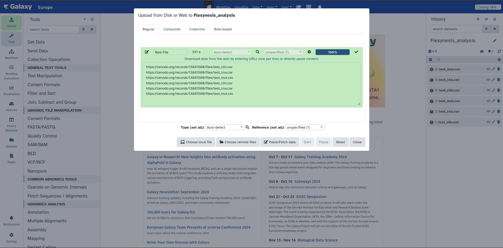
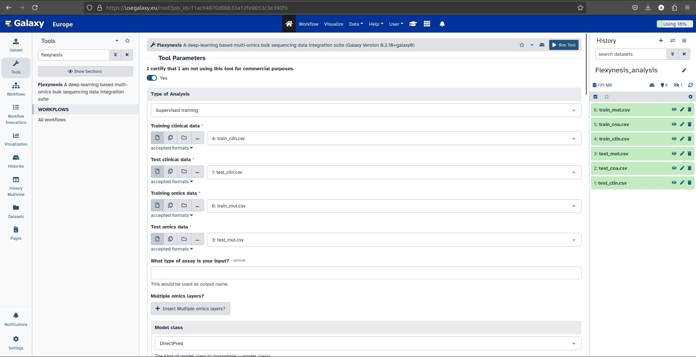
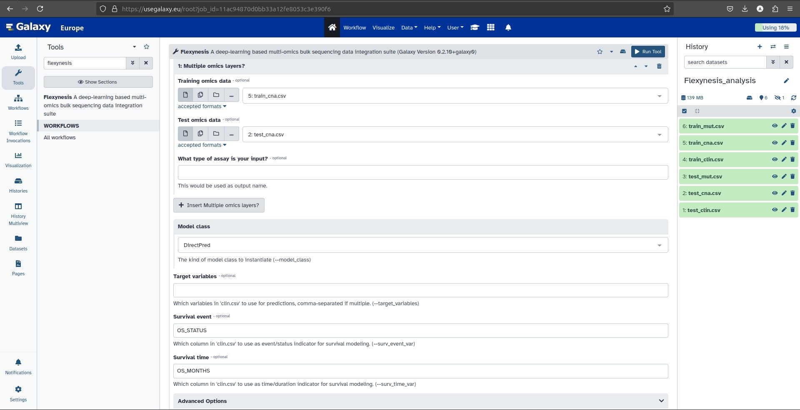
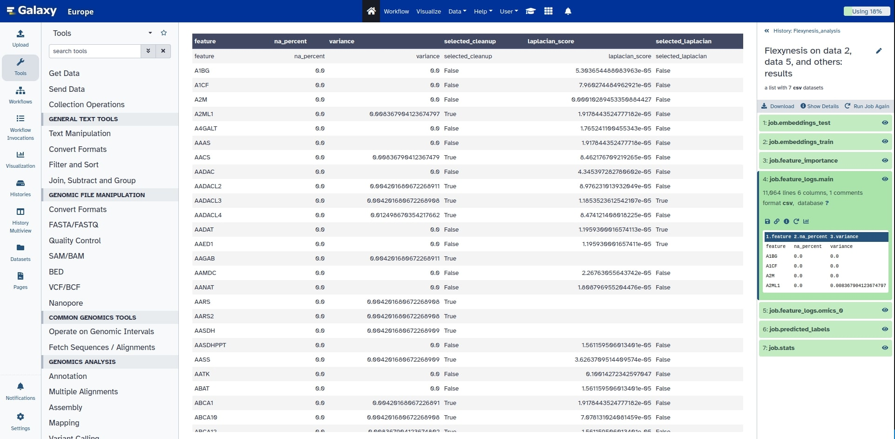

# Using Flexynesis on usegalaxy.eu

Here you will learn how to use the Galaxy platform to utilize flexynesis in multi-omic data integration for clinical variable prediction.

## First time using Galaxy?

You can check "**[Galaxy Basics for everyone](https://training.galaxyproject.org/training-material/topics/introduction/tutorials/galaxy-intro-101-everyone/tutorial.html)**" training to learn more about data analysis using Galaxy!

## Import a curated dataset

In this tutorial we will use a multi-omic dataset of Lower Grade Glioma (LGG) and Glioblastoma Multiforme (GBM) Merged Cohorts. The data were downloaded from [Cbioportal](https://www.cbioportal.org/study/summary?id=lgggbm_tcga_pub). The dataset was split into 70/30 train/test splits and used as input to Flexynesis.

```
https://zenodo.org/links
```

### Importing data via links
* Copy the above link locations.
* Click **Upload** at the top of the tool panel.
* Select **Paste/Fetch data**.
* Paste the links into the text field.
* Press **Start**.
* **Close** the window


<!--  -->

The example dataset contains 556 training samples and 238 testing samples. Each sample has both copy number variation and mutation data. The mutation data was converted into a binary matrix of genes-vs-samples where the value of a gene for a given sample is set to 1 if the gene is mutated in that sample, or it is set to 0 if no mutation was found for that gene.

### Check the data

Once your data turns green it means it is successfully uploaded to your history.
Click on the data and make sure the data format is "**CSV**".

In case that the format is not CSV (E.g. TXT), you should change it to csv.

* Click on the **pencil** icon for the dataset to edit its attributes.
* In the central panel, click on the **Datatypes** tab on the top.
* Click the **New Type** button and choose csv then click on **Save**.


### Supervised training

#### Survival

For survival analysis, two separate variables are required:
* **Survival event:** a numeric event variable (consisting of 0's or 1's, where 1 means an event such as disease progression or death has occurred).
* **Survival time:** a numeric time variable, which indicates how much time it took since last patient follow-up.

#### Let's start the analysis!

Search for "**flexynesis**" on **search tools** panel and select the tool.

**First you should certify that you are using flexynesis for Research/Educational purposes.**

Now continue with the following parameters to do a survival analysis using flexynesis on Galaxy.

* **Type of Analysis:** Supervised training

* **Training clinical data:** train_clin.csv
* **Test clinical data:** test_clin.csv
* **Training omics data:** train_mut.csv
* **Test omics data:** test_mut.csv

**What type of assay is your input?** is an optional parameter you can use to name your assay (E.g. cnv here). If not specified it will be named "main"



Click on **Insert Multiple omics layer?** to add the next layer.

* **Training omics data:** train_cna.csv
* **Test omics data:** test_cna.csv

**What type of assay is your input?** is an optional parameter you can use to name your assay (E.g. gex here). If not specified it will be named "omics_0"

* **Model class:** DirectPred
* **Survival event:** OS_STATUS
* **Survival time:** OS_MONTHS



Click on **Run Tool** to start your analysis!

Once the result turns green, the analysis is finished. Click on the dataset to explore the results!

